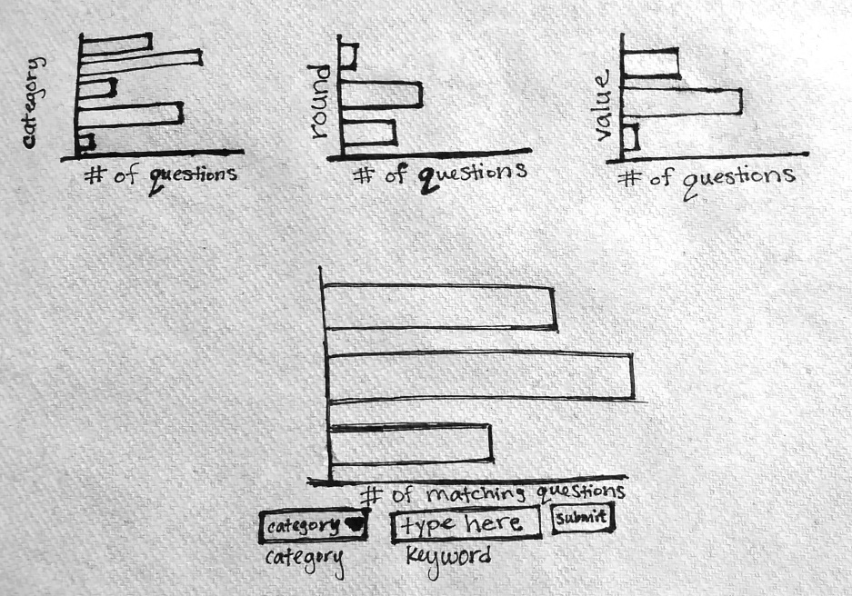
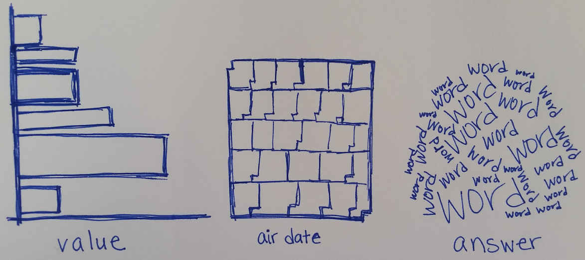

CS573 Final Project Proposal:

“29 Years of Jeopardy Questions”

[“29 Years of Jeopardy Questions” - Main Page](http://cjaiello.github.io/DataVisFinal/index.html)

[“29 Years of Jeopardy Questions” - Process Book](http://cjaiello.github.io/DataVisFinal/processBook.html)

[“29 Years of Jeopardy Questions” - Word Frequencies](http://cjaiello.github.io/DataVisFinal/compareWordFrequencies.html)

[“29 Years of Jeopardy Questions” - Data Breakdown](http://cjaiello.github.io/DataVisFinal/dataBreakdown.html)

----------------------------------------------------

1	Basic Info

“29 Years of Jeopardy Questions”

Christina Aiello

Email: cjaiello@wpi.edu

Github: cjaiello

https://github.com/cjaiello/DataVisFinal

----------------------------------------------------

2	Background and Motivation

My family has a fascination with trivia. They greatly enjoy watching Jeopardy and other trivia shows, they play Trivial Pursuit to show off their skills, and they’ll even just end up browsing Wikipedia pages for hours to read about different random topics. 

Not only is trivia something that family members of mine enjoy, but my friends and acquaintances (and really, many people in general) have a love for trivia games. Many bars and other venues will have trivia nights (We even have one here at WPI every week) where participants form teams and try to correctly answer as many trivia questions as they can. 

With this love for trivia questions in mind, I searched for data sets related to trivia and stumbled upon this fantastic data set of 216,930 Jeopardy questions.

----------------------------------------------------

3	Project Objectives

I would like to give users the ability to view the frequency of categories, to potentially show which are most likely to appear in a Jeopardy game. In addition, I want to let the user see which categories end up being in the Double Jeopardy and Final Jeopardy rounds most frequently. This could help a user target his or her knowledge to categories that end up in these rounds.

While I do have these goals, I also plan on letting the user explore the data himself or herself, meaning that the user will be able to sort the data first by one attribute (for example, “category”) and display the counts for that data, then sort the data by a second attribute (for example, “air date”) and display the counts, and finally sort by a third attribute (for example, “round”) and display the counts for each attribute.  

What I need to specifically disallow (to prevent gigantic and unreadable graphs)unless I can find visualizations that can support them is the ability to count based on the “question,” “air date,” “answer,” “category,” and the “show number” attributes due to there being 216,930 questions in the file. While some may be duplicates, sorting the data by question (or by these other aforementioned attributes) would create an enormous and useless graph. I could also do preprocessing to modify the data to allow some of these attributes to be used.

----------------------------------------------------

4	Data

Data was compiled by the user “trexmatt” of the website reddit.com. The user writes, “Questions were obtained by crawling www.j-archive.com. According to j-archive, the total number of Jeopardy! questions over the show's span (as of [January 11th, 2014]) is 252,583 - so this is approximately 83% of them. In particular, around the last two years of game play are missing.” 

The categories are described as,

•	“'category' : the question category, e.g. "HISTORY"

•	'value' : $ value of the question as string, e.g. "$200.” 

		o	Note: This is "None" for Final Jeopardy! and Tiebreaker questions

•	'question' : text of question

		o	Note: This sometimes contains hyperlinks and other things messy text such as when there's a picture or video question

•	‘answer’: answer to question

•	'round' : one of "Jeopardy!","Double Jeopardy!","Final Jeopardy!" or "Tiebreaker"

		o	Note: Tiebreaker questions do happen but they're very rare (like once every 20 years)

•	'show_number' : string of show number, e.g '4680'

•	'air_date' : the show air date in format YYYY-MM-DD”

Link to Reddit post:

https://www.reddit.com/r/datasets/comments/1uyd0t/200000_jeopardy_questions_in_a_json_file/

Link to location of data:

https://docs.google.com/uc?id=0BwT5wj_P7BKXUl9tOUJWYzVvUjA&export=download

----------------------------------------------------

5	Data Processing

The data is thankfully already in CSV format, and it has the following columns: Show number, air date, round (Jeopardy, Double Jeopardy, Final Jeopardy, or Tie-Breaker), category, value, and question.

I have a few ideas regarding information preprocessing the data, which would allow the users to select this data for sorting the graphs (rather than just not including these categories at all):

•	Changing the air date to be just a year

•	Changing the air date to be decades (80’s, 90’s, 00’s, 10’s)

•	Changing show number (which is currently 1 to 6,300) to be grouped by thousands (0-999, 1000-1999, 2000-2999, 3000-3999, 4000-4999, 5000-5999, 6000-6999)

•	Changing category to be grouped somehow (would require manually creating and categorizing each category), since there are 27,906 unique categories

I plan on counting the number of items per category and the number of items per value first, due to them not all being equal. For example, “3-Letter Words” has 342 entries and 4,579 entries. This could help a user figure out which categories are most likely to appear in a Jeopardy game. In addition, I am interested in seeing which categories end up being in the Double Jeopardy and Final Jeopardy rounds most frequently. This could help a user target his or her knowledge to categories that end up in these rounds.

Another feature I would like to have is (see “Optional Features” section below) the ability to let a user search the “question” section (or “answer” section) with any string he or she would like to find. The application would then display a table with all results matching this query, in addition to showing a count of matches.

----------------------------------------------------

6	Visualization Design

I would like the user to be able to sort the data by three categories of his or her choice, one at a time. This will produce three graphs on the screen, with the leftmost graph containing the most data points and the rightmost containing the least amount of data points. These three graphs will all be viewable on one screen, side-by-side.

In addition to letting the user sort the data by his or her choosing, I want the user to be able to search for keywords as well. I would like to add the ability to let a user search the “question” section  (or “answer” section) with any string he or she would like to find, and then the user would select an attribute of the data set to sort by. The application would then display a graph of that data (where the question has the keyword(s) that the user specified), separated by whatever options for the chosen attribute exist. I would also like to show a total number of matches for the keyword(s) in the entire set of data.

6.1	Idea #1:

•	Use all bar charts. 

•	Disallow “question,” “air date,” “answer,” “category,” and the “show number” attributes, due to them being very large.

•	Let user choose which attributes to sort by, and let them drill down into the data.

•	Christina's thoughts: This seems kind of boring… Don't get me wrong, bar charts are great, but three bar charts is way too plain.

6.2	Idea #2:

•	For air date, use a calendar chart (which would actually make using the air date data useable). I could potentially preprocess the data to be month and year, rather than day/month/year.

http://bl.ocks.org/mbostock/4063318

I could specifically have this visualization be created if the user chose to organize by air date.

•	For the question and answer attributes, use a word cloud for questions and answers (which would make using the question and answer data useable). https://www.jasondavies.com/wordcloud/#%2F%2Fwww.jasondavies.com%2Fwordcloud%2Fabout%2F | https://github.com/jasondavies/d3-cloud | I could specifically have this visualization be created if the user chose to organize by question or answer.

•	Bar charts for other data

•	Christina's Thoughts: This would be really cool, and it would also mean I can include more of the data from the dataset.

6.3	Idea #3:

•	Disallow “question,” “air date,” “answer,” “category,” and the “show number” attributes, due to them being very large.

•	Let user choose which attributes to sort by, and let them drill down into the data.

•	Let the user choose between a bar chart, a pie chart, or a treemap.

•	Christina's Thoughts: I really like letting the user choose what kind of visualization they want to see. Some people prefer certain visualizations, so giving them the option to choose would be awesome.

6.4 Final Idea?

•	I think I'd like a combo of #2 (preprocessing some data so it can be used, in addition to having Word Clouds and Calendar Charts) and #3 (letting the user choose between seeing data as a Tree Map, Bar Chart, or Pie Chart). This may make my stretch goals not doable (due to lack of time), however.

----------------------------------------------------

7	Must-Have Features

Let a user view the data first categorized by one attribute, then split up that data further via a second category, and lastly let the user select a third category to categorize the data with (letting them “drill down” into the data, so to speak). Rather than preselecting attributes for these three charts, I will let the user choose which attribute should be used with each chart.

----------------------------------------------------

8	Optional Features

I would like to add the ability to let a user search the “question” section with any string he or she would like to find, and then the user would select an attribute of the data set to sort by. The application would then display a graph of that data (where the question has the keyword(s) that the user specified), separated by whatever options for the chosen attribute exist. I would also like to show a total number of matches for the keyword(s) in the entire set of data. 

----------------------------------------------------

9	Project Schedule

Week	Feature(s)

Nov 17th – Nov 24th 	Develop functions to create the various visualizations needed, and preprocess the data set

Nov 25th – Dec 1st 	Create interaction piece of the project (letting user click on leftmost visualization and drill down deeper into the data, creating new charts to the right of the first chart)

Dec 1st – Dec 8th  	Continue development, user test the application, get feedback

Dec 8th – Dec 15th 	Make final changes

